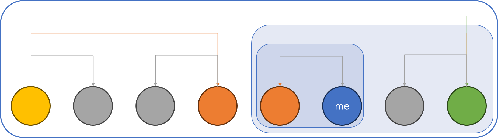
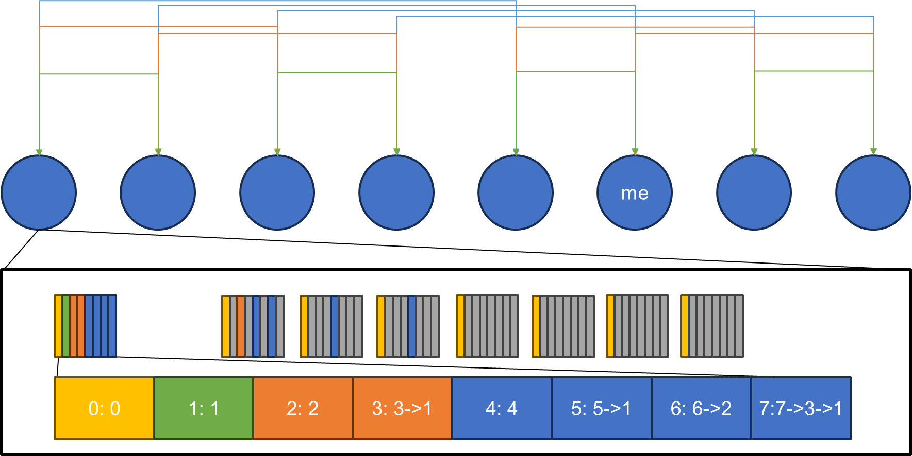
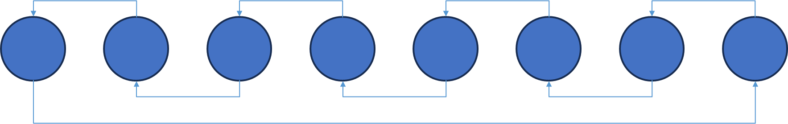

# Collective Communication algorithms

## MST (minimum spanning tree)

* broadcast: (1 -> n)
* reduce: (n -> 1)
* scatter: (1 -> n)
* gather: (n -> 1)

## BDE (bidirectional exchange)

* reduce-scatter: (n -> n)
* all-gather: (n -> n)

## BKT (bucket / ring algorithm)

* reduce-scatter: (n -> n)
* all-gather: (n -> n)

